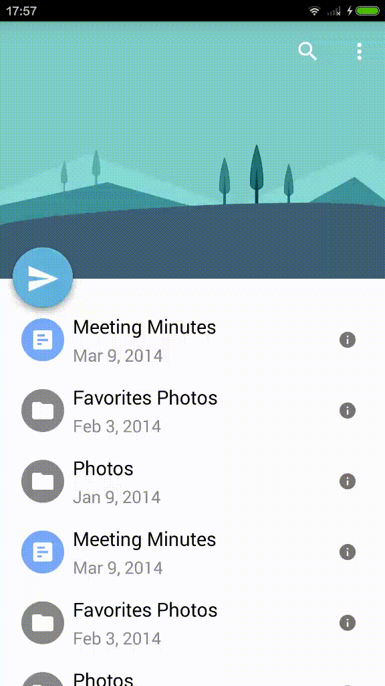

# FlyRefresh
The Android implementation of [Replace](https://dribbble.com/shots/2067564-Replace), designed by [Zee Youn](https://dribbble.com/zeeyoung).
I implement this as a **FlyRefresh** layout. The content of the layout can be any view, such as a ListView, RecyclerView, ScrollView, etc.

# How it looks


# Features
* Default minimize configuration for [Replace](https://dribbble.com/shots/2067564-Replace) animation
* Expendable/Shrinkable header
* Support custom header view
* Support custom refresh animation

# How to use

Add Gradle dependency:

```gradle
dependencies {
   compile 'com.race604.flyrefresh:1.0.0'
}
```

An example of basic usage in `layout.xml`:

```xml
<com.race604.flyrefresh.FlyRefreshLayout
  android:id="@+id/fly_layout"
  android:layout_width="match_parent"
  android:layout_height="match_parent">

    <android.support.v7.widget.RecyclerView
      android:id="@+id/list"
      android:layout_width="match_parent"
      android:layout_height="match_parent"
      android:paddingTop="24dp"
      android:background="#FFFFFF"/>
</com.race604.flyrefresh.FlyRefreshLayout>
```

Or you can use `PullHeaderLayout` for more configurations, you can set custom attributes as shown below:

```xml
<declare-styleable name="PullHeaderLayout">
    <!-- hader size -->
    <attr name="phl_header_height" format="dimension" />
    <attr name="phl_header_expand_height" format="dimension" />
    <attr name="phl_header_shrink_height" format="dimension" />
    <!-- header view id -->
    <attr name="phl_header" format="reference" />
    <!-- content view id -->
    <attr name="phl_content" format="reference" />
    <!-- Float action button icon -->
    <attr name="phl_action" format="reference" />
</declare-styleable>
```
For more, please turn to the source code.

# License
`FlyRefresh` is available under the MIT license.
